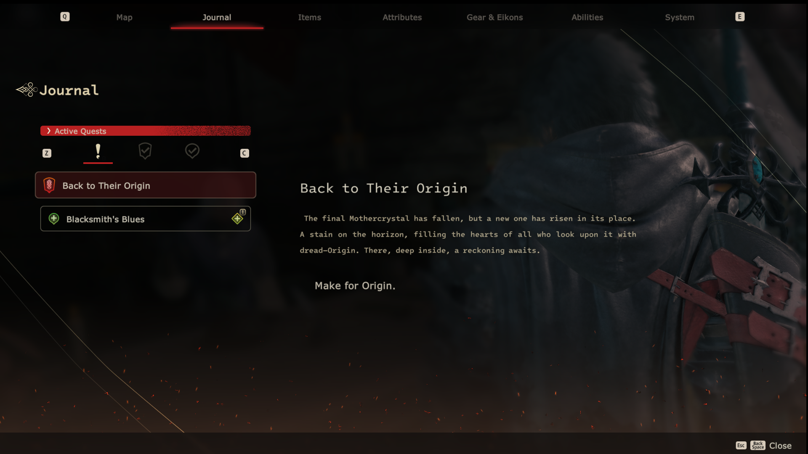

# FF16FontMaker
FF16FontMaker lets you mod fonts in Final Fantasy XVI. You can add new font styles, change font sizes and even use fonts for languages the game doesn't originally support.



## Installation

- Install [.NET 8](https://dotnet.microsoft.com/en-us/download/dotnet/8.0)
- Donwload [lastest release](https://github.com/eprilx/FF16FontMaker/releases).
- Run FF16FontMaker.exe in the cmd

## Usage


```
Usage: FF16FontMaker [OPTIONS]
Options:
      --fnt2ff16fnt          Convert Hiero FNT To Final Fantasy 16 FNT
      --ff16fnt2fnt          Convert Final Fantasy 16 FNT to Hiero FNT

Example:
FF16FontMaker --fnt2ff16fnt -f arianlt-demi.fnt -b test.fnt -o arianlt-demi.fnt.new
FF16FontMaker --ff16fnt2fnt -f arianlt-demi.fnt -o arianlt-demi.fnt.fnt
FF16FontMaker --fnt2ff16fnt -f arianlt-demi.fnt -b gen2.fnt --CustomXoffset 0 --CustomYoffset -68 --CustomXadvance 1.4 --CustomMultiYoffset 1.4

```

❄ Convert FNT to FF16FNT (Create new FNT)

- Unpack .fnt/.tex files using [FF16Tools](https://github.com/Nenkai/FF16Tools). All font files are located in data\0027\system\graphics\font2.
- Generate a signed distance field font using [Hiero](https://libgdx.com/wiki/graphics/2d/fonts/distance-field-fonts#generating-the-font)
- Convert png to .tex using [FF16Tools](https://github.com/Nenkai/FF16Tools)
- Convert fnt from Hiero to FF16FNT using this tool
- Use CustomXoffset, CustomYoffset, CustomMultiYoffset and CustomXadvance in case the font is displayed incorrectly

```
Usage: FF16FontMaker --fnt2ff16fnt [OPTIONS]
Options:
  -f, --originalFF16FNT=VALUE (required) Original Final Fantasy 16 FNT file (*.fnt)
  -b, --charDesc=VALUE        (required) Character description file from Hiero (*.fnt)
  -o, --NewFF16FNT=VALUE      (optional) Output new Final Fantasy 16 FNT file
      --CustomXoffset=VALUE   (optional) Custom xoffset, use to fix when font 'left' or 'right' than normal font, usually value [-100,100], default = 0
      --CustomYoffset=VALUE   (optional) Custom yoffset, use to fix when font 'upper' or 'lower' than normal font, usually value [-100,100], default = -50
      --CustomMultiYoffset=VALUE (optional) Custom multiYoffset, use to fix when some character upper but some character lower, usually value [1.0, 2.0], default = 1.4
      --CustomXadvance=VALUE  (optional) Custom xadvance, use to fix when font stretched/narrowed horizontally, usually value [1.0, 2.0], default = 1.4
```


❄ Convert FF16FNT to FNT
```
Usage: FF16FontMaker --ff16fnt2fnt [OPTIONS]
Options:
  -f, --originalFF16FNT=VALUE (required) Original Final Fantasy 16 FNT file (*.fnt)
  -o, --NewFNT=VALUE          (optional) Output Hiero FNT file
```

*NOTE: This feature is for viewing only; manually editing the original .fnt file is not recommended. To modify font values, generate a new .fnt with Hiero, make your edits, and then convert it to FF16FNT. You can easily find the original font's .ttf/.otf files online.*

## License
[MIT](LICENSE)